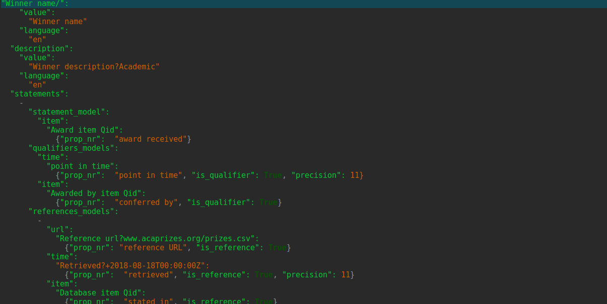

# Introduction

Wikibase_Universal_Bot is a tool for writing data to any Wikibase instance in a user-friendly way. 

It is based on [WikidataIntegrator](https://github.com/SuLab/WikidataIntegrator/), and it was intended for users willing to use Wikibase as a technology without having to learn to code for bots, that is, specific software to set the
upload features and process for the data that is going to be written.

Moreover, WikidataIntegrator presents some features tuned for working with Genes, Proteins, Diseases, Drugs and similar data (for example checking for consistency with medical or biological databases, or hard-coding some specific Wikidata property and services). Wikibase_Universal_Bot frees from those specificities while still providing, for example, for consistency checks, duplicate checks, items identification and selection.

Wikibase_Universal_Bot is not a wrap for the MediaWiki API. In fact WikidataIntegrator is a necessary dependence. In that sense 
Wikibase_Universal_Bot provide a higher layer abstracting away the necessity to code for bots and allowing to use WikidataIntegrator more transparently and in more generic ways.

# Installation

The simplest way to install is to clone the github repository:

```
git clone https://github.com/dcodings/

```

and then run *setup.py* as

```
cd Wikibase_Universal_Bot

python setup.py install

```

**Note**: the package installs the following dependencies, if not already present inthe system, 'requests', 'pandas', 'argparse', 'wikidataintegrator==0.0.555','configparser','pyyaml'.
However it does **not** install the specific dependencies of wikidataintegrator which happen not to be listed in its setup.py file (see here below).

**Note**: it seems that [WikidataIntegrator versions higher than 0.0.509](https://github.com/SuLab/WikidataIntegrator/blob/master/wikidataintegrator/wdi_core.py) require the package tqdm, but that is not specified in its setup.py file. It may thus be necessary to install tqdm manually. Previous versions of WikidataIntegrator does not seem to have that issue.

**Note**: versions of [WikidataIntegrator higher than 0.0.555](https://github.com/SuLab/WikidataIntegrator/blob/master/wikidataintegrator/wdi_core.py) force a search on the Wikibase of interest for so-called "core_props" using a query with hard coded property and item P2302 and Q21502410. As users may not be able/want to set those property and item with those specific identifiers, nor they may want to have "core_properties", we require as dependencies WikidataIntegrator version 0.555 or 0.509.


# Usage instructions

Wikibase_Universal_Bot does not require knowledge of bot coding from the user.
The user is only required to provide:

1. a [*data model file*](#the-data-model-file) in yaml format

1. a [*configuration .ini file*](#the-configuration-file) containing the parameters for the connection and login on the Wikibase instance, and the user-chosen settings for the WikidataIntegrator parameters

1. a [*data file*](#the-data-file) (at the moment necessarily in .csv format) or a pandas.DataFrame holding the data to be written in the Wikibase.

The user can then 

* either run the main module of the package as a script with the relevant arguments:

	*Example:*     

	<pre><code>
	cd WikibaseUniversalBot

	python -m wikibase_universal_bot.wikibase_universal_bot.py &#45;&#45;data-file <i>datafilename.csv</i> \--datamodel-file <i>modelfilename.yml</i>     \--wikibase-integrator-config-file <i>configfilename.ini</i>
	</code></pre>

* or import this package in a python script (or jupyter notebook) as

	```

	import wikibase_universal_bot

	```


	and use any of the methods in the *wikibase_universal_bot.py* modulus to read data and parameters in various formats.

# Output of Wikibase_Universal_Bot

By running Wikibase_Universal_Bot the users obtains three outcomes:

1. new data is (should!) written into the designated Wikibase

1. a file in csv format containing the items written in the Wikibase and enriched with their Wikibase IDs (in new columns with title obtained by appending to the original corresponding data columns the string "_item_Qid"). This file is created in a newly created folder with name *enriched_data* in the directory where the program is run. 

	If the original dataset to be written was passed to Wikibase_Universal_Bot as a csv file, then the enriched data filename is obtained using the original data file and appending to it the string "_enriched_DATETIME" where DATETIME is actually the date time of when the new file was created.	

	If instead no initial csv data filename was provided (data was provided directly with a pandas.DataFrame), the name of the file is "Data_enriched_DATETIME". 

1. a file in csv format containing items that could not be written because of some error or conflict for further inspection. The conflicting data are written together with the row of the data file that was containing them, so that this can directly become (when conflicts are resolve) a new data file to write in the Wikibase. The name of the file is "ConflictsWikibase_DATETIME", with DATETIME the same datetime of the data enriched file.


# Necessary data and configuration files

A detailed examples of the content all relevant files is presented [later on](#example).

## The data file

The data to be written can be passed to Wikibase_Universal_Bot either via pandas.DataFrames, when the package is used in a python script, or via a .csv file by executing the *wikibase_universal_bot.py* script on the command line.

---

**Data reconciliation.**

Wikibase_Universal_Bot wites statements about items both if their Wikibase ID is provided (obviously for items that already exist in the Wikibase of interest), and if their label is given ((but no Wikibase ID).

In the second case, the software can perform a check on the existence or not existence of items with the same o similar label and is *fairly conservative*: 

1. if only a single item is found having exactly the same label (string matching) or one of the aliases matches with the label string of the item we want to write, than the item is considered to be the same and the new statements are added to the already existing element

1. if there are multiple elements with matching label or aliases and in particular at least one of such items has alias/label **exactly matching** the one of the item to be written, then 

	* if the user has set  `reconciliated_trust_unique_label_exist` to **True**, then Wikibase_Universal_Bot can identify the item to be written with an existing item with the exact same label, even in presence of other items with similar labels, and thus it does not write a new item, but updates the one with identical label; if there are more than one item with identical label Wikibase_Universal_Bot raises an exception

	* if the user has set `reconciliated_trust_unique_label_exist` to **False** or has not set it, the program considers this a conflict, no statement is written nor item created and all is logged in the *ConflictsWikibase_DATETIME.csv* file

1. if there are one or more already existing Wikibase items such that the supposedly new item label is a **substring** of their label or aliases, then again the program behaves in two ways (configurable):

	* if the user has set `force_creation_new_if_other_exist_with_similar_label` to **True** in the [*data model file*](#the-data-model-file)) then Wikibase_Universal_Bot writes the item (up to conditions, see the section about the [*data model file*](#the-data-model-file)) and does not log a conflict

	* if the user has set `force_creation_new_if_other_exist_with_similar_label` to **False** or **not set it** in the [*data model file*](#the-data-model-file)) considers this a conflict, no statement is written nor item created and all is logged in the *ConflictsWikibase_DATETIME.csv* file.


**Best practice.**

For maximum safety, it is always recommended to first reconciliate the items of the dataset one wants to write into the Wikibase **before** using Wikibase_Universal_Bot.
If there is conflict due to labels between the new to-be-writtem items and some already in Wikibase, it may be necessary to create manually the item with the desired but conflicting label, get in this way a Wikibase ID, augment the conflicting data rows with that information and use the new ID data column to write the model (see the [*data model file*](#the-data-model-file)) and the items in Wikibase. 

** Note about using pandas.DataFrame.**

As explained [before](#output-of-Wikibase_Universal_Bot), Wikibase_Universal_Bot enriches the data it is given to write. If one user has passed a pandas.DataFrame as the initial data container, this will be augmented with new columns. Therefore, if the user has actually passed in a **copy** of a pandas.DataFrame (for example because the passed-in pandas.DataFrame is a slice of another one), pandas will raise its well-known *SettingWithCopy* warning when the pandas.DataFrame will be enriched. The solution is just not to pass copies. One can also simply ignore the warning since in the end, anyway, the enriched pandas.DataFrame will be written to a csv output file, and everything will be readable from there. 

---


## The configuration file

In order to write data on a Wikibase instance, Wikibase_Universal_Bot must be passed the relevant parameters for the connection configuration to the Wikibase instance, other parameters of the Wikibase itself, and the parameters that the user may want/need to set for the WikidataIntegrator writer.

These parameters can be passed to the program by listing them in a configuration file. In more details:

1. the configuration file must have extension *.ini*

1. the configuration file must contain four sections:
   
    * WIKIDATA

		This section comprises a series of *key: value* lines, where keys are:
    
        * `user`: username with bot account 
        * `password`: password of the bot
        * `mediawiki_api_url`: the url of the Mediawiki API for the Wikibase instance of interest, for example http://blabla.wmflabs.org/w/api.php
        * `sparql_endpoint_url`: the URL of the sparql query service of the Wikibase in question
        * `wiki_language`: the language of the Wikibase in questions; the language codes are available [here](#https://www.wikidata.org/wiki/Help:Wikimedia_language_codes/lists/all)
   
    * PROPERTIES
   
    	This section contains a series of *key: value* lines, where the keys are the labels of the properties present in the Wikibase instance where the user wants to upload the data, and the values are the PNumber identifiers of the properties. 
    
    	For example, suppose that the Wikibase has a property with identifier P2 and label "instance of", then one of the lines in the section PROPERTIES will be:
    
        ```
        instance of: P2
        ```
    
        It is _necessary_ to list at least all properties relevant for the statements that one wants to write and load in the Wikibase instance (that is, all properties appearing in the [data model](#the-data-model-file) file).
   
    * ITEM_ENGINE_PARAMETERS
   
    	This sections can be used to give values to all parameters used by the __init__() method of WikidataIntegrator.WDItemEngine **except** 1) the single elements wikibase IDs and names, 2) the statements (called "data" in the signature of the __init__() method) and raw JSON for the single elements, 3) the "mediawiki_api_url" and "sparql_endpoint_url". 
    
    	The list of configurable parameters in Wikibase_Universal_Bot version 0.0 corresponds to the list of parameters in the __init__() methods of the [WDItemEngine class in WikidataIntegrator version 0.0.555](https://github.com/SuLab/WikidataIntegrator/blob/master/wikidataintegrator/wdi_core.py):
    
        * `domain`   (Note: this parameter must always be given a non-empty string value, for example _ in order to avoid what seems to be a bug in WikidataIntegrator)
        * `append_value`   (Note: this parameter is in particular relevant, as one can provide a string of property IDs, separated by commas, whose value, if present should not be overwritten when the new data is written into the Wikibase)
        * `fast_run` 
        * `fast_run_base_filter`
        * `fast_run_use_refs`
        * `ref_handler`
        * `global_ref_mode`
        * `good_refs`
        * `keep_good_ref_statements`
        * `search_only`
        * `user_agent`.
   
    	For an explanation of the meaning and effects of such settings we point the user to the [documentation of WikidataIntegrator](https://github.com/SuLab/WikidataIntegrator/).
    
    	Future versions of Wikibase_Universal_Bot are not guaranteed to maintain the list of configurable parameters in sync with the updates in the version(s) of WikidataIntegrator.
    
    * WRITE_PARAMETERS
    
    	This section allows the user to specify relevant parameters affecting the writing of data in the Wikibase instance. Version 0.0.555 of WikidataIntegrator allows to specify the parameters:
    	
        * `edit_summary`=String (Short -max 250 characters- summary of the purpose of the edit; it will be displayed as the revision summary of the Wikidata item. Defaults to empty string.)
        * `write`=Boolean (If `False`, do not actually perform write. Action will be logged as if write had occurred. Defaults to True.)
		* `bot_account`=Boolean (Defaults to True.) 
		* `entity_type`='item' (Decides wether the object will become an item (default) or a property (with 'property')
		* `property_datatype`='string' (Sets the datatyupe for the property if that is to be written. Defaults to string.)
		* `max_retries`=Integer (If api request fails due to rate limiting, maxlag, or readonly mode, retry up to `max_retries` times Defaults to 10.), 
		* `retry_after`=Integer (Number of seconds to wait before retrying request (see max_retries), defaults to 30).
    
## The data model file

The data model file contains the specification of the model for the dataset that the user wants to write into the Wikibase instance. 

As we mentioned, Wikibase_Universal_Bot reads the data from a csv file or a pandas.DataFrame, hence the data are in tabular form. Data in a Wikibase instance (RDF graph) are instead recorded as statements concerning the graph nodes (which we call items). 

In particular, statements are generally of two forms: 

* *subject item* -- *predicate (property)* -- *object item* 

or 

*  *subject item* -- *predicate (property)* -- *value*.

The data model is then essentially a map of the the subjects and object/values of the statements to the relevant column names of the table (csv file or DataFrame) holding the data.
The data model file must be a *yaml* file, and thus the model specifications is written in *yaml* markup language.

Wikibase_Universal_Bot reads through the data table row by row, and the model specifies which columns to consider at each row in order to combine those data into statements.

In the data model file, the model consists of a series of blocks, where each block describes one focus node and the statements having that node as subject, mapping the subject, objects and values to the relevant column names in each row of the data. 

**Very importantly** due to the Wikibase API, the object item must **always** be identified via Wikibase IDs. As the statements values and objects to be written are read from relevant data columns, it would appear that the column(s) for  the object items **must** be columns containing Wikibase IDs (for the Wikibase the user wants to write into). 

This would seem to imply that such object item must already exist in the Wikibase (for them to have Wikibase IDs) before we start writing the new data. In fact Wikibase_Universal_Bot avoids this problem and allows to write also datasets dealing with object items **not** already existing items in the Wikibase of interest thanks to suitable specification in the data model file, as we will illustrate in a [later section](#special-features-and-utilities-writing-multiple-nodes-from-each-row-of-data-writing-statements-with-object-items-not-existing-in-the-Wikibase)).

We will now provide a high-level description of the blocks, a quick (but sufficient for the user purposes) recap of elements of the *yaml* markup language relevant for the use of Wikibase_Universal_Bot, and finally a detailed description of the block features. 

### High level description of the blocks

We start by giving an example of a block. This is a part of the data model file we will present in its entirety [later](#example). In particular, in order to present in the image an example of a block showing as much as possible of all main features, we are not following (in this image) the [best practices](#best-practice-organisation-of-data-model-file) which are recommended when writing a data model. The data this data model block refers to is contained in a series of columns in a csv file with titles **"Winner name", "Award", "Date award", "Awarded by"**

[//]: # 

In general terms, therefore, a block has the form 

<a name="data-model-block"></a>
<pre><code>
<i>name of column for subject</i>:
  "label": 
    <i>{key:value pairs for label}</i> 
  "description": 
    <i>{key:value pairs for description}</i>
  "aliases": 
    <i>{key:value pairs for aliases}</i>
  "force_creation_new_if_other_exist_with_similar_label":
    <i>Boolean</i>
  "reconciliated_trust_unique_label_exist":
    <i>Boolean</i>
  "core_props": <i>{key: value}</i>
  "statements": 
    List[{"statement_model": 
            <i>{key: value for statement}</i>,
          "qualifiers models": 
            <i>{key:value pairs for  qualifier}</i>,
          "references models": 
            List[<i>{key:value pairs for reference}</i>]
          }]
</code></pre>
In the above code we have italicised the parts that are to be changed by the user (replacing them for example with the actual name of the relevant column, or with the key:value pairs of choice -see below for further details-).

The above block schema indicates, therefore, that when processing one row, 

*   the piece of data in column "*name of column for subject*" will be used as subject of the statements modeled in the same block, with 

* a "label" specified by the relevant *{key:value label pairs}* , 

* a "description" specified by the relevant *{key:value description pairs}*, 

* some "aliases"  specified by the relevant *{key:value aliases pairs}*, 

* a condition concerning the item writing: "force_creation_new_if_other_exist_with_similar_label"

	**Important**: the boolean "force_creation_new_if_other_exist_with_similar_label" acts only if the block **dow not** have any "statements" part. It is indeed a setting for purely creating new items and cannot check if statements need to be updated as well. See also the [best practices](#best-practice-organisation-of-data-model-file) in writing the data model file.

* a condition concerning the item writing   "reconciliated_trust_unique_label_exist", which, if True, guarantees that when Wikibase_Universal_Bot searches for the existence of an item via its label we are confident there will be only a single item with the exact same label and Wikibase_Universal_bot will thus update that item rather than creating a new one.

* and finally a list of "statements", each with a model with its *{key:value}* and possibly some "*qualifiers*" and a list of "*references*" (models) with their relevant *{key: values}* pairs

* a series of `core_props` (core properties) which will be used as identifiers to identify items

Note that each block part key (that is, "label", "description", "aliases" and "statements") is indented by two spaces with respect to the "*name of column for subject*", and furthermore any of these block parts may actually be absent. The rules of indention are particularly relevant in yaml files, so we provide here below a quick guide.


#### Minimal necessary elements of *yaml* markup language

The various {key:value pairs} and the various Lists have to be written in yaml formalism, see for example [here](https://learnxinyminutes.com/docs/yaml/). In particular, using somewhat standard terminology, {key: value pairs} are called "maps" and the value can be also another "map" or a List (nested map or list). Maps can also be nested in Lists, and so Lists in Lists.

The main elements that a user need to now about all this are 

1. that a **map** with several key:value pairs such as

    ```
    {key1:value1, key2:value2, ....}
    ```

    is written by stacking the `key:value`'s vertically, as:

    ```    
    key1: value1                
    key2: value2    
    ....      
    ```
    
1. that a nested map is written by **indenting it** with respect to the higher level key **by two spaces**. So for example in the above case if *value1* is itself a map of the form *{kv1: vv1, kv2:vv2} then the end result would be

    ```
    
        key1:    
          kv1: vv1      
          kv2: vv2      
        key2: value2    
        ....
            
    ```

    or also (using JSON notation)

    ```
    key1:
      {kv1: vv1, kv2: vv2}
    key2: value2
    ....
    ```    
    
1. a **list** such as [item1, item2, ....] is indicated by dashes

    ```
    - item1
    - item2
    - ....
    ```
    
1.  once again, if those list items are a (nested) map of the form, say, *{kitemX1: vitemX1, kitemX2: vitemX2, ....}* then we need to indent it (with respect to the hyphens) by two characters as follows:

    ```
    - 
      kitem11:      
        vitem11        
      kitem12:      
        vitem12        
    - 
      kitem21:      
        vitem21        
      kitem22:      
        vitem22                
    - ....
    
    ```
1. again, if we want to indent a list within a list, we still use dashes to represent the nested list, and we use the usual rule by indenting the nested list by two spaces with respect to the containing list.
      
Finally, we remind that commenting is allowed in yaml files, and comment lines have to be prepended by the "#" character.

### Specifics of the various {key: value} pairs in the above schematic block model

In this section we again italicise the parts that are to be changed by the user (replacing them for example with the actual name of the relevant column, or with the actual type of the item under consideration).

---

**First of all**: always remember that *keys* are case sensitive (so "starting time" is different from "Starting time"). 

---
  
The various {key: value} pairs in the above schematic block model are different depending on which block part we are considering:

1. "label", "description", "aliases" parts in the blocks have all a similar structure for their respective `{key: value}` pairs, as the latter all have the form:

    <a name="label-description-aliases-block"></a>
    <pre><code>
    "value":
      <i>"name of column containing labels or description or aliases"</i>
    "language":
      <i>"string indicating language of item labels or description or aliases"</i>  
    </pre></code>

1. "core_props" parts must have a **specific series of** `key:value` **pairs**: <i>{key: value}</i>:

    <pre><code>
    "PXX": {"datatype": "datatype string","name": "property name","domain": ["string"],"core_id": boolean}
    </pre></code>

   where PXX is the identifier of one of the core properties, and the value is a dictionary which must contains **all** the above-indicated keys ("datatype, "name", "domain", "core_id"), as they are required by WikidataIntegrator

1. "statement model", "qualifiers models", "references models" parts of the block also have a similar structure for their {key: value} pairs. Let us in fact recall that *qualifiers* and *references* are indeed statements, having for subject the statement they qualify and reference about.

	Their {key: value} pairs can all be written as follows:

    <a name="statements-qualifiers-references-block"></a>
    <pre><code>
    <i>"data type of object of statement or qualifier or reference"</i>:
      <i>"name of column containing object/value of statement or qualifier or reference"</i>:
        "default_args":
          {"prop_nr":<i>"name of predicate (property)"</i>, otherkey:value, ....}
        "instance_mutable_args":
          {key:value pairs}
    </pre></code>
    Here above, by **"default_args"** we mean all *key:value* pairs where the value will be the same (default indeed) for each data row of the dataset  (that is, the value is independent from the row). 

	For instance, the value of the "prop_nr" key (that is, the label of the property to be used as predicate for the statement or qualifier or reference modeled by this block of code) is a default argument because it does not change from row to row (a statement has the same predicate property when going through all data row by row). 

	[Note: in fact, *"prop_nr":value* is a default **and mandatory** *key:value* pair, because without it a statement (or qualifier or reference) cannot even be formed.]
    
    Instead, **"instance_mutable_args"** are arguments whose value changes per item (that is, per row). [Note: or at least it is supposed to change, although it may happens that in a set of items they all have by pure chance the same numerical value, say, for a property.}

	For instance, if the object of a statement is a quantity value whose unit of measurement may change in each row, then the key:value pair having "unit" as key (see also here below) will be part of the "instance_mutable_args". (Of course, it may happen that the unit of measurement is the same for all items, so "unit" will in thaqt case be a key in the *"default_args"*).
    
    In the case where there are **no "instance_mutable_args"** one can simplify the model writing

    <a name="statement-qualifiers-references-block"></a>	
    <pre><code>
    <i>"data type of object of statement or qualifier or reference"</i>:
      <i>"name of column containing object of statement or qualifier or reference"</i>:
        {"prop_nr": <i>"name of predicate (property)"</i>, key:value pairs}
    </pre></code>

    
    However,
    
    * "qualifiers models" and "references models" parts **must have the `key:value` pair**
	<pre><code>
		 *"is_qualifier": True* </pre></code> 
	and respectively
	<pre><code>
		*"is_reference": True* 
	</pre></code>
		among the pairs indicated here above as `otherkey:value, ....` in the "default_args".
    
	Overall, what [here above](#statements-qualifiers-references-block) has been indicated as `otherkey:value, ....` in the "default_args" and as `key:value pairs` in the "instance_mutable_args" are essentially the parameters of the data type of the object of the statement or the qualifiers or references in Wikibase (as implemented in [WikidataIntegrator](https://github.com/SuLab/WikidataIntegrator/)).
    
    The [data types available in Wikibase](https://www.wikidata.org/wiki/Help:Data_type) which are modeled in Wikibase_Universal_Bot are indeed (indicated here with their configurable *key:value* pairs):
    
    * "string"
    
    * "wikibase-item"
    
    * "monolingualtext", with configurable `key:value` pair 

		* *"language"= String*
    
    * "quantity", with configurable `key:value` pairs 
	
		* *"upper_bound"=FloatValue* 
		* *"lower_bound"=FloatValue* 
		* *"unit"=String (either the label or the Wikibase ID of a Wikibase item representing the WikiBase unit a certain quantity has been measured in, see https://www.wikidata.org/wiki/Wikidata:Units. If the *"unit":string* pair is not specified in the model when a *quantity* datatype is present, then the quantity is considered dimensionless. 

			The String can also have the format "SomeString?QXX", which means that the unit of measure will be defaulted to the item identified by QXX in the Wikibase for all items to be written. 

			**Note**: if the String is the label of an item, then the key:value pair  `"find_qid": True` **must** be present as well among the statement/qualifier key:value pairs)
                        
    * "wikibase-property"
    
    * "time", with configurable `key:value` pairs 

		* *"precision": IntegerValue* 
		* *"timezone":IntegerValue* 
		* *"calendarmodel":URL_address*
    
    * "url"
    
    * "globe-coordinate", with configurable `key:value` pairs 
		
		* *precision: FloatValue* 
		* *globe=URL_address*
    
    * "commonsMedia"
    
    * "math"
    
    * "geo-shape"
    
    * "external-id" 

    All types can also have the other configurable key:value pairs:
  
	* `"snak_type"`=String
	* `"rank"`=String (chosen among 'preferred', 'normal' or 'deprecated')
	* `"check_qualifier_equality"`=Boolean.
   
   Finally, a couple of particular *keys*

1. cases where a statement (or qualifier or reference) about a **single subject** has **multiple objects/value** in a **single cell** of the data table column (that is, the value in the cell is actually a list) **must be signalled** in the yaml model using the *key:value* pair:
 
	* `"onesubject_manyobjects"`:True (to be put in the "instance_mutable_args");
	
	*Example*: the column we are interested in writing in the Wikibase is "Swimmers" and we want to build up statements about their participation to the Olimpics, with a column titled "Olympic games" having for values the list of dates of the Olympic games particpated to. For instance, the row of "Ian Thorpe" has in that column a cell value [2000, 2004]. Since a subject can thus have many object (lists with more than one value in them), we must use the `"onesubject_manyobjects":True` key:value pair.

1. the *key:value* pair

	* *"find_qid":Boolean*

	can be in the "default_args" of the data types *wikibase-item* and *quantity* (the latter, when the *"unit"* key is used), and forces or avoids to retrieve the Wikibase IDs of the object item or unit item of the statement in question. It finds the string by matching either the string in the `"unit":string` pair or the object column name (the *"name of column containing object of statement or qualifier or reference"* in the model).

	If the object or unit item do not exist in the Wikibase or more than one ID is retrieved for the same item label, Wikibase_Universal_Bot raises an Exception and logs a Conflict. 

	Note that if the user sets `find_qid: True` and the label/string to be matched is actually already the Wikibase ID of the item, then Wikibase_Universal_Bot logs a Conflict and raises an Exception. The reason is that Wikibase considers IDs as aliases, but the software checks for the matching with the label, and this will not match with the ID. 

---
**Important Note**: the data type "globe-coordinate" has values specified by two quantities: "latitude" and "longitude". These pieces of data (used as the object of a statement or qualifier, or reference) must be written in the cells of the relevant data column as

```
latitude_value;longitude_value
```

and the separator between the two values (in that order) **has to be a colon**. Note that the values must be expressed **in decimal (float) form**, so for example latitude 43°52'44"N must be converted into 38.898556.

---

###  Specification of additional features by special formatting of the strings indicating the name of the column(s) containing the subject and object of statement or the object of qualifier or reference 

We illustrate here how one can add more information and thus obtain a more convenient and useful model by adding some tags to the strings indicating the name of the column(s) containing the subject and object of statement or the object of qualifier or reference in the above presented [model block](#data-model-block) and *key:value* pairs such as [this](#label-description-aliases-block) and [this](#statement-qualifiers-references-block).

There are various features implemented in this sense in Wikibase_Universal_Bot:

1. we want to give each items (each row) a default value for a column, independently from the values that are actually present in the dataset in that column:

	* then instead of using a string with the simple column name, we append to it a question mark "?" and, after it, the default value we desire.

		**Example**: we have a dataset of people in academy and a column with name "People Profession" listing all of their work titles/occupations (Professor, Researcher, ....) but we instead want all the items to have the description "Academic". Then, instead of using "People Profession" as "*"name of column containing description"*" in the [description block](#label-description-aliases-block), we use "People Profession?Academic".

1. in the dataset we do not have one piece of data (that is, there is not dedicated column and we do not want to add it to the csv or pandas.DataFrame directly), which is equal for all items (all rows). Then we can use again the "?" variation of the previous point by writing in the relevant model blocks parts: "ColumnNameAtWill?DesiredDefaultValue".

		**Example**: let us consider a modification of the example of the previous point. We still have a dataset of people in academy but now there is not column with their work titles/occupations, which, as before, we want to be "Academic" for all of them and use that as descriptions. Then, we replace "*"name of column containing description"*" in the [description block](#label-description-aliases-block) with "ProfessionTitle?Academic" (or anything else we may want to use instead than "ProfessionTitle").

1. the "*name of column for subjects*" in the [model block](#data-model-block)
 can be a column containing indeed values we want to use as names (labels) for the items, but also Wikibase identifiers (which are strings in the form "QXX" where XX are numbers), if those items are already present in the Wikibase and we want just to add or update some statements. These two cases must be distinguished. This is done by formatting the string containing the relevant column name(s) in the data model blocks. 
	
	The quick rule is that:

	* if the "*column for subjects*" is a column **not containing** Wikibase IDs (for the Wikibase we intend to write into) --> use the string obtained by appending to the column name a trailing "/" (and then any other substring if you want for any reason: it will be ignored anyway by the program)

		**Important**: This also means that in the original column names of our dataset there **must** not be any "/" characters, as they will be interpreted by Wikibase_Universal_Bot as the indication of a *name of column for subjects*, if they are used for that, by chopping off anything after the first "/"/ character, which may lead to unexpected results.
	* if the "*column for subjects*" is a column **containing** Wikibase IDs (for the Wikibase we intend to write into) --> no need to do anything

	**Example**: imagine that we want to record in a Wikibase statements about some people. Imagine also that we have a column called "PeopleNames" in our dataset, containing Names and Surnames of the persons in question (this is just an example: the important point here is *a column that does **not** contain IDs for those people from the Wikibase we want to write upon*). 

	Imagine also that the Wikibase instance in question actually already contains data on those people, so that they have in particular Wikibase identifiers listed in another column in our dataset called, say, "People Wiki IDs".

	Then we can choose as "*column for subjects*" in the data model block above both the column "PeopleNames" with Names and Surnames or the column with the Wikibase IDs, but the choice has to be signalled as follows:

	* If we want to use in our data model block using "PeopleNames" as the *name of column for subjects*, then we need to append to it a trailing "/" character (actually the "/" character does not have to be the last one: any character following the first "/" will be ignored anyway).

		Effectively, this then means that the column name to write as a replacement to *name of column for subjects* is "PeopleNames/Anything". 

	* If we want to use in our data model block using "People Wiki IDs" as the *name of column for subjects*, then we can simply use it with no modification.

###  Special features and utilities (writing multiple nodes from each row of data, writing statements with object items not existing in the Wikibase)

As we [mentioned](#the-data-model-file), the Wikibase API requires statements' object items in RDF statements to be identified by their Wikibase ID, thus requiring them to be already present in the Wikibase instance, before being able to use them in statements to be written.

There are different way-outs to this issue. The simplest one is simply to indeed create those items before using them as object in statements. This would entail a a workflow as follows:

1. write a data model file for those items not already existing on the Wikibase but with no statements involving them as objects

1. fetch the Wikibase IDs of these new items after they have been created in the Wikibase

1. add to the dataset csv or pandas.DataFrame a relevant number of columns to hold (and align correctly row-wise) the newly created Wikibase IDs for those items (at least those we need to use as objects for statements to be later written in)

1. write another data model file with a model now also containing statements involving those items as objects

1. write the relevant statements into the Wikibase

This workflow is however slow and laborious, so **Wikibase_Universal_Bot has been designed to be able to support a different, much more streamlined workflow**:

1. write a single data model file including statements using not-yet-existing Wikibase items as object, but organise the file in a specific way (see [below](#best-practice-organisation-of-data-model-file))

1. write into Wikibase

1. Wikibase_Universal_Bot will check on conflicts with already existing items inthe Wikibase using labels and aliases and will output a csv dataset of conflicts. Then we may have to solve those conflicts following the longer workflow (but typically the work is much reduced at this point).

#### Best practice organisation of data model file

The best practice when writing the data model file is to take advantage of the fact that Wikibase_Universal_Bot has been designed with two functionalities:

1. collects and orders correctly (row-wise, respect to the initial dataset) the Wikibase IDs of newly created items and organises them in columns with title obtained by appending the string 

	```
	"_item_Qids" 
	```

	to the title of the column used (as column holding the subject/label) to create the new items.


	For example, if we created a number of items about people using as their subject (label) column a column holding their names and having title "PeopleNames", then Wikibase_Universal_Bot will collect and organises the IDs of the newly created items in a column with title "PeopleNames_item_Qids".

1. Wikibase_Universal_Bot also collects the IDs of items already exists but whose Wikibase IDs is not present in the original dataset, again storing those IDs in a column whose title is obtaining appending "*_item_Qids*" to the title of the relevant subject/label column (selected automatically on the basis of the data model file).


Hence for best practice, it is best to organise the data model file in **two parts**.

1. the first one will contain only blocks with no statements (at least no statements using items as objects), which one can call *item creation blocks*

	These blocks will then contain at most of "label", "description", "aliases" sub-blocks and, optionally, settings for the creation of items, as follow

	<a name="creation-data-model-block"></a>
	<pre><code>
	<i>name of column for subject</i>:
	  "label": 
	    <i>{key:value pairs for label}</i>
	  "description": 
	    <i>{key:value pairs for description}</i> 
	  "aliases": 
	    <i>{key:value pairs for aliases}</i> 
	  "force_creation_new_if_other_exist_with_similar_label": 
	    <i>Boolean</i>
          "reconciliated_trust_unique_label_exist":
            <i>Boolean</i>
          "core_props": <i>{key: value}</i>
	</code></pre>

1. the second part of the data model file will contain *statements-writing blocks*, where the subject column title has been augmented with the "*_item_Qids*" string, and all sorts of statements are allowed

	<a name="statements-writing-data-model-block"></a>
	<pre><code>
	<i>original name of column for subject+"_item_Qids"</i>:
	  "statements": 
	    List[{"statement_model": 
	            <i>{key: value for statement}</i>, 
	          "qualifiers models": 
	            <i>{key:value pairs for  qualifier}</i>, 
	          "references models": 
	            List[<i>{key:value pairs for reference}</i>]
	          }]
	</code></pre>

## EXAMPLE

We revisit the example we have partially presented in previous sections, giving a full implementation of the configuration file and of the data model file following best practices.

**Dataset**

Imagine that we want to record in an English language Wikibase statements about some people in academia who have won prizes (such as the Nobel Prize, the Abel Prize and possibly many others). The original dataset is in a csv file with columns having titles:
**"Winner name", "Award", "Award name in original language", "Award monetary value", "Award currency", "Award foundation time", "Date award", "Awarded by", "Brief description of awarding entity", "Affiliation at the time",  "Affiliation institute brief description"**. We also suppose none of these columns contain Wikibase IDs (for example, we imagine "Awards" contains the name of prizes -for instance, "Nobel prize"- and not Wikibase IDs if the Nobel prize was already an item there).

Imagine also this dataset was fetched on 18-08-2018 from a database called AcaPrizesDatabase, curated by the AcaPrizes association  (web address www.acaprizes.org) who provides the content as a csv files at the address www.acaprizes.org/prizes.csv.

** Configuration file**

 Imagine we want to write statements in a Wikibase instance with API address https://mywiki.org/w/api.php and SPARQL point at https://mywiki-query.org using a BOT account with username "maym" and password "1234". Moreover, we want to use the following properties existing in the Wikibase: 

* *"affiliation"*: P36 (data type: wikibase-item)
* *"award received"*: P37 (data type: wikibase-item)
* *"point in time"*: P27 (data type: time)
* *"conferred by"*: P88 (data type: wikibase-item)
* *"stated in"*: P31 (data type: wikibase-item)
* *"retrieved"*: P32 (data type: time)
* *"curator"*: P33 (data type: wikibase-item)
* *"monetary value"*: P20 (data type: quantity)
* *"reference URL"*: P40 (data type: URL)
* *"inception"*: P16 (data type: time)

The configuration file then would look like (possibly)

```
[WIKIDATA]
user: maym
password: maym@1234
mediawiki_api_url: https://mywiki.org/w/api.php
sparql_endpoint_url: https://orig-query.wmflabs.org/
wiki_language: en

[PROPERTIES]
affiliation: P36
award received: P37
point in time: P27
conferred by: P88
stated in: P31
retrieved: P32
curator: P33
monetary value: P20
reference URL: P40
inception: P16

[ITEM_ENGINE_PARAMETERS]
fast_run: False
domain: _      # WikidataIntegrator: Always need to set this explicitely to a non-empty string.                                                                       
append_value: P37

[WRITE_PARAMETERS]
edit_summary:

```

Note that we have written label and identifiers in the Wikibase of the properties we will use for our statements (section [PROPERTIES]) and we have stated that values/objects of the property P37 should be appended (instead than replaced, so that if a person wins more than one prize, they are all written) in section [ITEM_ENGINE_PARAMETERS]. 

**Data model file**

Following best practices the data model file can be written as follows: 

```yaml

# First part: just label , descriptions and aliases.

"Award/":
  "label":
    "value":
      "Award"
    "language":
      "en"
  "description":
    "value":
      "Award description?Award"
    "language":
      "en"          
  "aliases":
    "values":
      "Award name in original language"
    "language":
      "en" # This is the language a description for the alias(es) will be set in.

"Award currency/":
  "label":
    "value":
      "Award currency"
    "language":
      "en"  
    "language":
      "en"
  "description":
    "value":
      "Currency description?Currency unit"
    "language":
      "en"          
      
"Awarded by/":
  "label":
    "value":
      "Awarded by"
    "language":
      "en"
  "description":
    "value":
      "Brief description of awarding entity"
    "language":
      "en"    
 
"Winner name/": 
  "label":
    "value":
      "Winner name"
    "language":
      "en"  
  "description":
    "value":
      "Winner description?Academic"
    "language":
      "en"   

"Affiliation at the time/Recall at the time!":
  "label":
    "value":
      "Affiliation at the time"
    "language":
      "en"
  "description":
    "value":
      "Affiliation institute brief description"
    "language":
      "en"    

"Database/":
  "label":
    "value":
      "Database?AcaPrizesDatabase"
    "language":
      "en"  
  "description":
    "value":
      "Database description?Database containing data on prizes awarded to academics."
    "language":
      "en"

"Database curator/":
  "label":
    "value":
      "Database curator?AcaPrizes"
    "language":
      "en"  
  "description":
    "value":
      "Database curator description?Association for the recognition of academic work."
    "language":
      "en"

# Second part: model for the statements we want to write.

"Winner name item Qid":  
  "statements":
    -
      "statement_model":
        "item": 
          "Award item Qid": 
            {"prop_nr":  "award received"}
      "qualifiers_models":
        "time": 
          "Date award": 
            {"prop_nr":  "point in time", "is_qualifier": True, "precision": 9} # precision: 11 means "year", see https://www.mediawiki.org/wiki/Wikibase/DataModel#Dates_and_times
        "item":
          "Affiliation at the time item Qid": 
            {"prop_nr":  "affiliation", "is_qualifier": True}
        "quantity":
          "Award monetary value":  
            "default_args":          
              {"find_qid": True, "prop_nr": "economic value", "is_qualifier": True}
            "instance_mutable_args":
              {"unit": "Award currency item Qid"}            
      "references_models":
        - 
          "url": 
            "Reference url?www.acaprizes.org/prizes.csv": 
              {"prop_nr": "reference URL", "is_reference": True}
          "time": 
            "Retrieved?+2018-08-18T00:00:00Z": 
              {"prop_nr":  "retrieved", "is_reference": True, "precision": 11}
          "item":
            "Database item Qid":
              {"prop_nr":  "stated in", "is_reference": True}
            "Database curator item Qid":
               {"prop_nr":  "curator", "is_reference": True}
              
"Award item Qid":  
  "statements":
    -
      "statement_model":
        "item": 
          "Award foundation time": 
            {"prop_nr":  "inception"}
      "references_models":
        - 
          "url": 
            "Reference url?www.acaprizes.org/prizes.csv": 
              {"prop_nr": "reference URL", "is_reference": True}
          "time": 
            "Retrieved?+2018-08-18T00:00:00Z": 
              {"prop_nr":  "retrieved", "is_reference": True, "precision": 11}
          "item":
            "Database item Qid":
              {"prop_nr":  "stated in", "is_reference": True}
            "Database curator item Qid":
               {"prop_nr":  "curator", "is_reference": True}
    - 
      "statement_model":
        "item":
          "Awarded by item Qid": 
            {"prop_nr":  "conferred by"}
      "references_models":
        - 
          "url": 
            "Reference url?www.acaprizes.org/prizes.csv": 
              {"prop_nr": "reference URL", "is_reference": True}
          "time": 
            "Retrieved?+2018-08-18T00:00:00Z": 
              {"prop_nr":  "retrieved", "is_reference": True, "precision": 11}
          "item":
            "Database item Qid":
              {"prop_nr":  "stated in", "is_reference": True}
            "Database curator item Qid":
               {"prop_nr":  "curator", "is_reference": True}
```


## Missing values in the dataset that are automatically solved or logged without crashing by Wikibase_Universal_bot.

1. If the item name column in the yaml model is a column name that does not exists, then
	1. if the label column exists and the value of the cell corresponding to that item is not Nan, then the item name will be put equal to the label
	1. still the newly created column with the Qid of the newly created item will be called "item name column"+" item Qid" and **not** "label column"+" item Qid"
	1. if both the item name column and the label column indicated in the model do not exists and there is no Qid column for the item with a non-Nan or not string-null value, the program will stop due to Exception
	1. if both the values in the item name column and the label column cells (when the columns exist) are null strings or Nan and there is no Qid column for the item with a non-Nan or not string-null value, the program will stop due to Exception.

1. Cases where there is one focus node (one subject) and many statements whose objects are in a single cell of a column (the value in the cell is a list) must be signalled in the yaml model using the "onesubject_manyobjects" instance variable parameter.


# Exceptions and Wikibase-related issues.

I have experienced some glitches in the Wikibase (docker) software. For example, when writing a statement or quelifier involving the "unit" key, Wikibase complains about a "wrong URL" but actually correctly write the statement. (The URL comes from the fact that the "unit" value must be encoded as an URL; Wikibase_universal_bot does it apparently correctly, as the item is written, but there may to be a setting in the Wikibase software concerning the namespace which could cause this false exception).